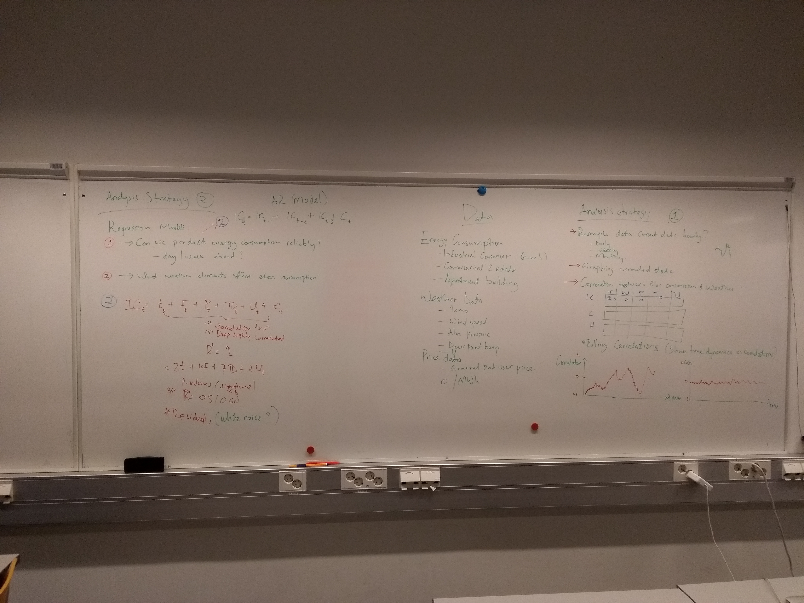
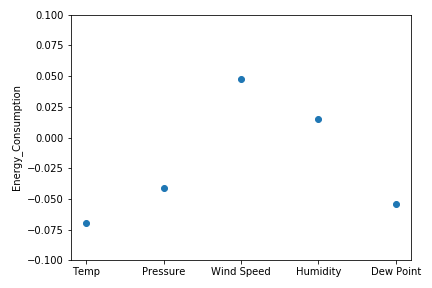
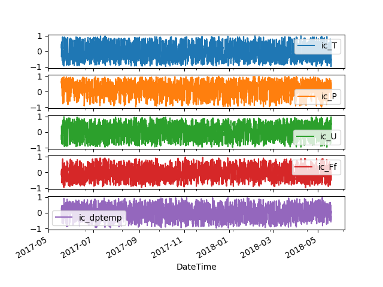
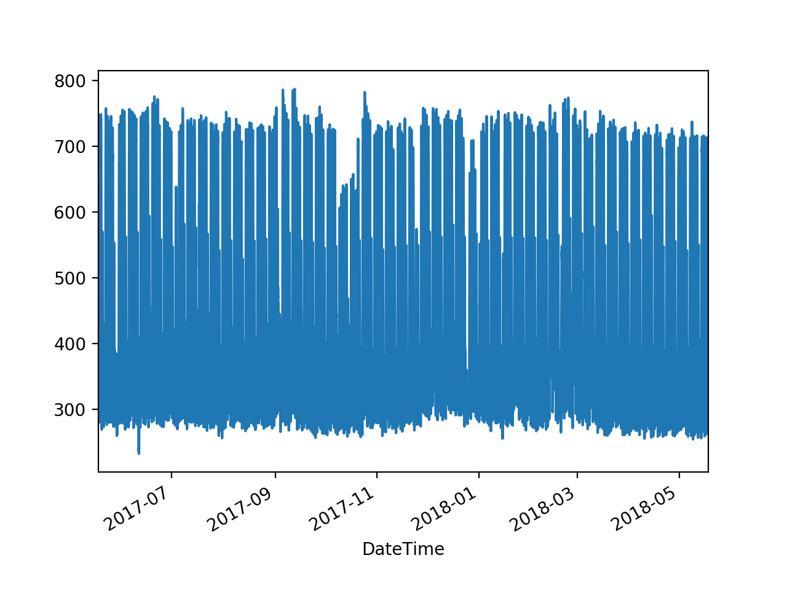

[Introduction](./index.html) | [Analysis](./pages/analysis.html) | [Link to page 3](./pages/another-page.html). | [Link to page 4](./pages/another-page.html)

Electricity is a major contributor towards the cost of running facilities either in a commercial setting or a household setup. In this project we model electricity demand for three different categories of real estate projects - An Industrial Consumer, a Commercial Building and a Commercial Real Estate (apartment block).

The objective is to use currently available electricity demand/usage data and weather data to analyze, model and forecast electricity demand across the three categories of electricity customers.

Electricity prices are additionally observed to be volatile and therefore tend to induce significant cashflow and earnings management challenges in an industrial or commercial setting where electricity consumption is significant. Electricity demand forecasting can therefore provide significant cost saving benefits as projected demand can be used to purchase electricity from energy markets in forward looking markets thus providing cash flow flactuation and earnings management.

### Data Description
<Insert Data Description>
  
### Project plan

Some text about the plan and idea and then the picture.



## Correlation
Here some stuff of correlation between the different weather parameters and energy consumption.

#### "Static" correlations
Static correlation showning roughly how different weather parameters affect to the energy consumption. When the correlation is negative (temperature for example) it means that when temperature goes down the electricity consumption goes up.



#### Rolling correlations

Rolling correlations for of different weather attributes and energy consumption for the industrial customer (ic).



## Regression models
* What weather elements affect the electricity consumption?
* Can we predict energy consumption reliably and how far ahead?


# Header 1

Text can be **bold**, _italic_, or ~~strikethrough~~.

This is a normal paragraph following a header. GitHub is a code hosting platform for version control and collaboration. It lets you and others work together on projects from anywhere.

## Header 2

> This is a blockquote following a header.
>
> When something is important enough, you do it even if the odds are not in your favor.

### Header 3

```js
// Javascript code with syntax highlighting.
var fun = function lang(l) {
  dateformat.i18n = require('./lang/' + l)
  return true;
}
```

```ruby
# Ruby code with syntax highlighting
GitHubPages::Dependencies.gems.each do |gem, version|
  s.add_dependency(gem, "= #{version}")
end
```

#### Header 4

*   This is an unordered list following a header.
*   This is an unordered list following a header.
*   This is an unordered list following a header.

##### Header 5

1.  This is an ordered list following a header.
2.  This is an ordered list following a header.
3.  This is an ordered list following a header.

###### Header 6

| head1        | head two          | three |
|:-------------|:------------------|:------|
| ok           | good swedish fish | nice  |
| out of stock | good and plenty   | nice  |
| ok           | good `oreos`      | hmm   |
| ok           | good `zoute` drop | yumm  |

### There's a horizontal rule below this.

* * *

### Here is an unordered list:

*   Item foo
*   Item bar
*   Item baz
*   Item zip

### And an ordered list:

1.  Item one
1.  Item two
1.  Item three
1.  Item four

### And a nested list:

- level 1 item
  - level 2 item
  - level 2 item
    - level 3 item
    - level 3 item
- level 1 item
  - level 2 item
  - level 2 item
  - level 2 item
- level 1 item
  - level 2 item
  - level 2 item
- level 1 item

### Small image


### Just an image header H3




### Definition lists can be used with HTML syntax.

<dl>
<dt>Name</dt>
<dd>Godzilla</dd>
<dt>Born</dt>
<dd>1952</dd>
<dt>Birthplace</dt>
<dd>Japan</dd>
<dt>Color</dt>
<dd>Green</dd>
</dl>

```
Long, single-line code blocks should not wrap. They should horizontally scroll if they are too long. This line should be long enough to demonstrate this.
```

```
The final element.
```
