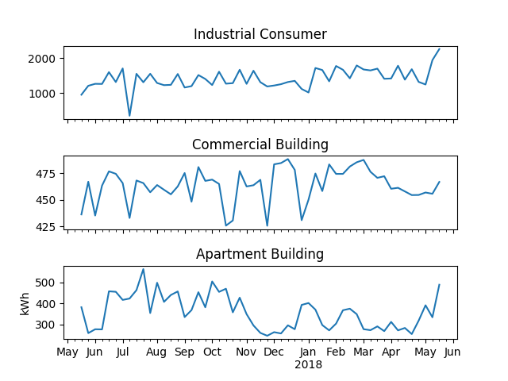
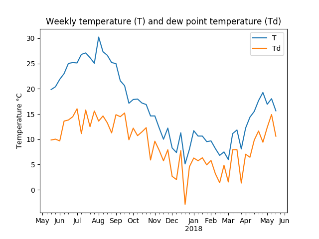

[Introduction](./index.html) | [Analysis](./pages/analysis.html) | [Link to page 3](./pages/another-page.html). | [Link to page 4](./pages/another-page.html)

Electricity is a major contributor towards the cost of running facilities either in a commercial setting or a household setup. In this project we model electricity demand for three different categories of real estate projects - An Industrial Consumer, a Commercial Building and a Commercial Real Estate (apartment block).

The objective is to use currently available electricity demand/usage data and weather data to analyze, model and forecast electricity demand across the three categories of electricity customers.

Electricity prices are additionally observed to be volatile and therefore tend to induce significant cashflow and earnings management challenges in an industrial or commercial setting where electricity consumption is significant. Electricity demand forecasting can therefore provide significant cost saving benefits as projected demand can be used to purchase electricity from energy markets in forward looking markets thus providing cash flow flactuation and earnings management.

### Data Description

Three different kind of data is used, three different data sources so to speak. Energy price data which tells the daily price for electricity in the given location, electricity demand/usage data and weather data. The data spans a one year. The price data is per day. Electricity consumption data is hourly usage data and the weather data is also in hourly format.

The data is resampled to daily, weekly, monthly form when needed.

###### Consumption data

Consumption data contains usage data for one year for three different premises, industrial building, commercial building and commercial real estate. Each of the locations have one meter so one number for the amount of electricity usage. The electricity consumption is in [Kilowatt hour](https://en.wikipedia.org/wiki/Kilowatt_hour).

###### Weather data

Weather data has five attributes/features temperature (T), pressure (P), humidity (U), wind speed (Ff) and dew point (Td).

| attribute    | full name         | info
|:-------------|:------------------|:------------------|
| T            | Temperature       | [https://en.wikipedia.org/wiki/Temperature](https://en.wikipedia.org/wiki/Temperature) |
| P            | Pressure          |[https://en.wikipedia.org/wiki/Pressure](https://en.wikipedia.org/wiki/Pressure) |
| U            | Humidity           |[https://en.wikipedia.org/wiki/Humidity](https://en.wikipedia.org/wiki/Humidity) |
| Ff           | Wind speed        |[https://en.wikipedia.org/wiki/Wind_speed](https://en.wikipedia.org/wiki/Wind_speed) |
| Td           | Dew point         | [https://en.wikipedia.org/wiki/Dew_point](https://en.wikipedia.org/wiki/Dew_point)|

###### Price data

The price data contains daily price for the electricity. Electricity cost is calculated based on it by multiplying daily usage with the cost.

