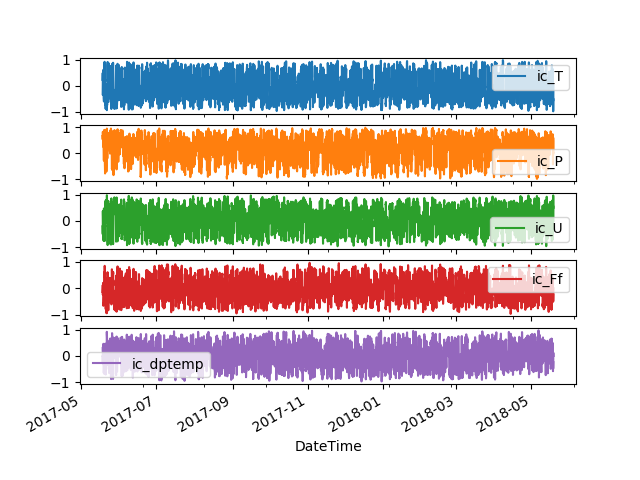

[Introduction](./../index.html) | [Correlation Analysis](./../pages/corr_analysis.html) | [Forecasting](./../pages/another-page.html). | [Link to page 4](./pages/another-page.html)

## Correlation Analysis
In this section we model the correlations in the data primarily investigating the relationship between various weather parameters with energy consumption of different sample consumer segments.

### "Static" correlations
Correlation map below indicates how different weather parameters are correlated to energy consumption across the three customer segments including how the weather parameters correlate. When the correlation is negative (temperature for example) it means that when temperature goes down the electricity consumption increases.


The energy consumer segments have positive correlations although low while temperature has a positive correlation with enery consumption in a commercial building and an apartment block while the correlation is negative for an industrial consumer.

#####
Industrial energy consumption and weather parameters


#####
Commercial building energy consumption and weather parameters


#####
Residential block energy consumption and weather parameters


#### Rolling correlations

Rolling correlations for of different weather attributes and energy consumption for the industrial customer (ic) indicating that the correlations are not stable through out the sample period



## Regression models
* What weather elements affect the electricity consumption?
* Can we predict energy consumption reliably and how far ahead?


# Header 1

Text can be **bold**, _italic_, or ~~strikethrough~~.

This is a normal paragraph following a header. GitHub is a code hosting platform for version control and collaboration. It lets you and others work together on projects from anywhere.

## Header 2

> This is a blockquote following a header.
>
> When something is important enough, you do it even if the odds are not in your favor.

### Header 3

```js
// Javascript code with syntax highlighting.
var fun = function lang(l) {
  dateformat.i18n = require('./lang/' + l)
  return true;
}
```

```ruby
# Ruby code with syntax highlighting
GitHubPages::Dependencies.gems.each do |gem, version|
  s.add_dependency(gem, "= #{version}")
end
```

#### Header 4

*   This is an unordered list following a header.
*   This is an unordered list following a header.
*   This is an unordered list following a header.

##### Header 5

1.  This is an ordered list following a header.
2.  This is an ordered list following a header.
3.  This is an ordered list following a header.

###### Header 6

| head1        | head two          | three |
|:-------------|:------------------|:------|
| ok           | good swedish fish | nice  |
| out of stock | good and plenty   | nice  |
| ok           | good `oreos`      | hmm   |
| ok           | good `zoute` drop | yumm  |

### There's a horizontal rule below this.

* * *

### Here is an unordered list:

*   Item foo
*   Item bar
*   Item baz
*   Item zip

### And an ordered list:

1.  Item one
1.  Item two
1.  Item three
1.  Item four

### And a nested list:

- level 1 item
  - level 2 item
  - level 2 item
    - level 3 item
    - level 3 item
- level 1 item
  - level 2 item
  - level 2 item
  - level 2 item
- level 1 item
  - level 2 item
  - level 2 item
- level 1 item

### Small image


### Just an image header H3


### Definition lists can be used with HTML syntax.

<dl>
<dt>Name</dt>
<dd>Godzilla</dd>
<dt>Born</dt>
<dd>1952</dd>
<dt>Birthplace</dt>
<dd>Japan</dd>
<dt>Color</dt>
<dd>Green</dd>
</dl>

```
Long, single-line code blocks should not wrap. They should horizontally scroll if they are too long. This line should be long enough to demonstrate this.
```

```
The final element.
```

[back](./..)
